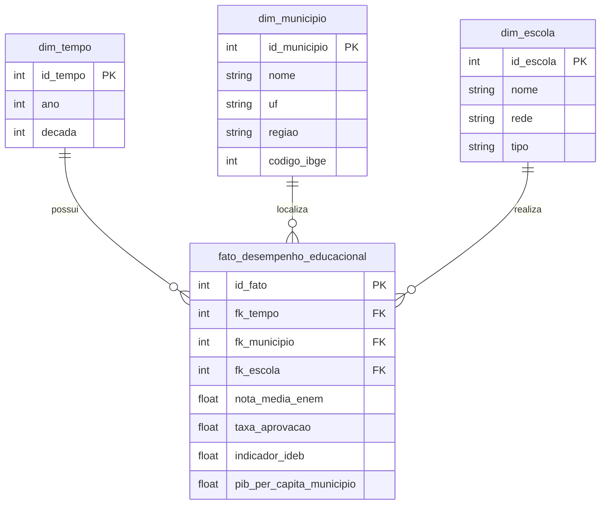

# Diagrama - Modelo Dimensional (Esquema Estrela)

```mermaid
erDiagram
    fato_desempenho_educacional {
        int id_fato PK
        int fk_tempo FK
        int fk_municipio FK
        int fk_escola FK
        float nota_media_enem
        float taxa_aprovacao
        float indicador_ideb
        float pib_per_capita_municipio
    }
    
    dim_tempo {
        int id_tempo PK
        int ano
        int decada
    }
    
    dim_municipio {
        int id_municipio PK
        string nome
        string uf
        string regiao
        int codigo_ibge
    }
    
    dim_escola {
        int id_escola PK
        string nome
        string rede
        string tipo
    }
    
    dim_tempo ||--o{ fato_desempenho_educacional : "possui"
    dim_municipio ||--o{ fato_desempenho_educacional : "localiza"
    dim_escola ||--o{ fato_desempenho_educacional : "realiza"
```
